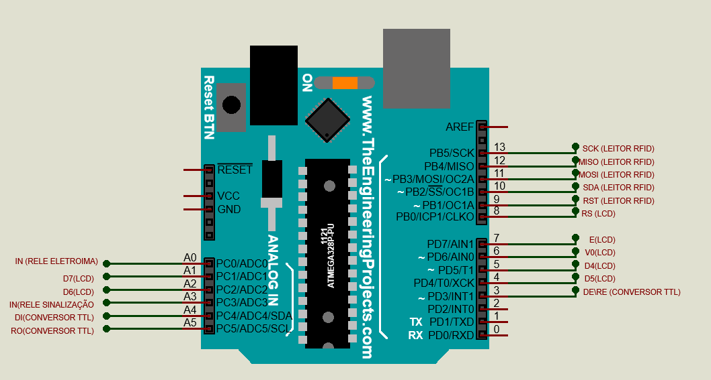

# controle_acesso_RFID

> O projeto concite em controlar o acesso de um determinado local, sendo o acesso liberado apenas para os funcionários que estão cadastrados no sistema.

> O código fonte e instruções aqui contempla apenas a parte de codificação e montagem do circuito do arduino R3. O software de controle foi desenvolvido na linguagem C# usando a IDE visual studio 2019 community e esta disponível em outro repositório.

## Video demostrativo do projeto

https://www.youtube.com/watch?v=jrNVpYFj1XA&ab_channel=CaioJunior

## Montagem

### Pinos leitor RFID X Arduino
Signal    |   MFRC522   |   Arduino
-------   | ----------- | ---------
RST/Reset |  RST        |   09
SPI SS    |  (SS)       |   10
SPI MOSI  |  MOSI       |   11 / ICSP-4
SPI MISO  |  MISO       |   12 / ICSP-1
SPI SCK   |  SCK        |   13 / ICSP-3

### Pinos LCD X Arduino
   LCD       |   Arduino
 ----------- | ---------
  D7         |   A1
  D6         |   A2
  D5         |   04
  D4         |   05
  v0         |   06
  E          |   07
  RS         |   08

### Pinos Conversor TTL X Arduino
   Conversor      |   Arduino
 ----------- | ---------
  DE/RE      |   03
  DI         |   A4
  RO         |   A5

### Pinos Rele X Arduino
   Rele      |   Arduino | Função
 ----------- | --------- | ------------------
  IN         |   A0      | Ativar eletroíman
  IN         |   A3      | Ativar sinalização

### Esquema elétrico

